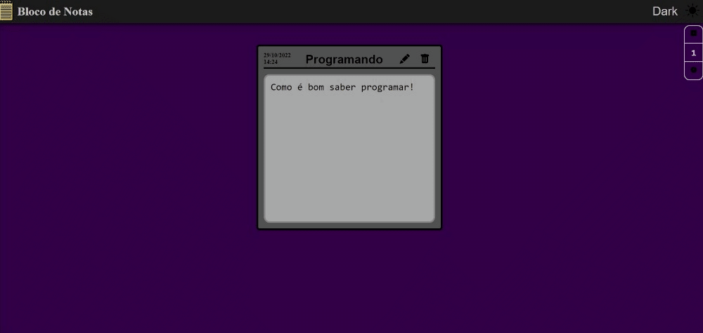

# Bloco de notas JS

Um projeto feito para estudo pessoal! Utilizando SASS e Javascript vanilla! 
# [Live Demo](https://blocodenotas.daniloo.dev/) - Teste a aplicação.
## Project features

#### Cria notas dinamicamente
#### Remove notas dinamicamente
#### 2 temas: Dark e Light

## GIF do Projeto

## License

[MIT](https://choosealicense.com/licenses/mit/)
